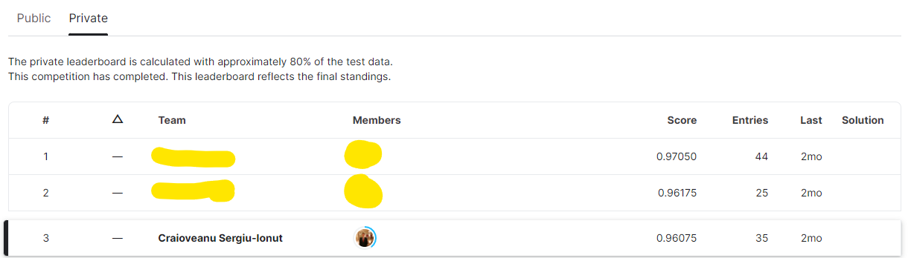

# PML-Smarthphone-User-Identification-Competition

Placed 3rd (out of 80) in the Practical Machine Learning course Kaggle Competition, where all students in first year of University of Bucharest AI MSc would compete against each other for best model score. Dataset was composed of accelerometer timeseries on multiple axis and the purpose was to classify users based on behavior.

## Competition Details

The task is to discriminate between 20 mobile device users. For each user, there are 450 accelerometer signal recordings (examples) available for training. The signals are recorded for 1.5 seconds, while the user taps on the smartphone's screen. The accelerometer signal is recorded at 100 Hz, thus containing roughly 150 values. The values are recorded on three different axes: x, y, z.

Each example is assigned to 1 of 20 classes. The training set consists of 9,000 labeled examples. The test set consists of another 5,000 examples. The test labels are not provided with the data.

Link to competition can be found here: [https://www.kaggle.com/competitions/pml-2022-smart/data](Link)

## Results



## Approach

The winning approach involved using a library called TSFresh to extract a large number of relevant features from the time series data. To make the data extraction richer and more relevant, for each time step I also calculated the accleration magnitude. I then used a more extensive CatBoost Classifier for prediction. The magic was actually in finding the best method for extracting features - modelling didn't play an important of a role as I was initially led to believe.

## How to Setup

- Install Miniconda/Anaconda
- Create a conda envrionment using the following command:
```
conda env create -f environment.yml
```

